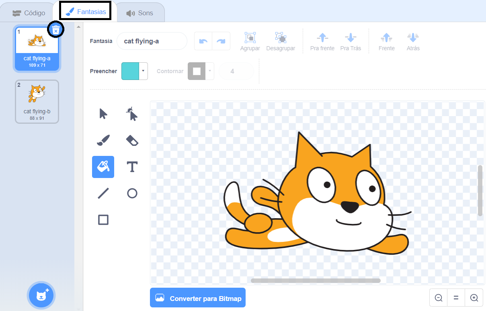
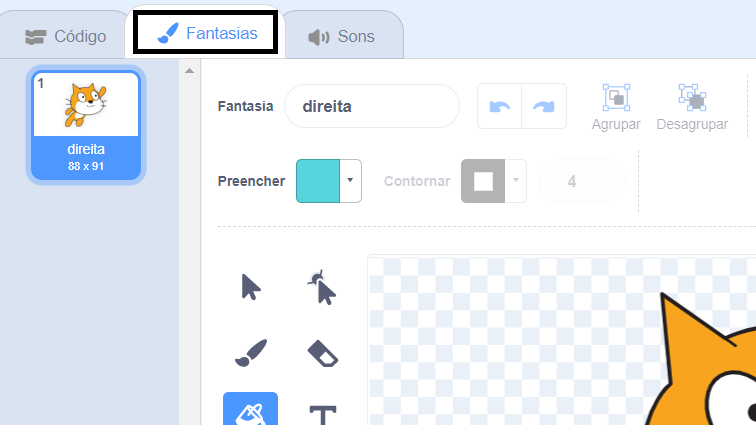
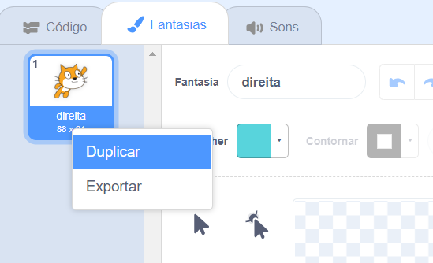
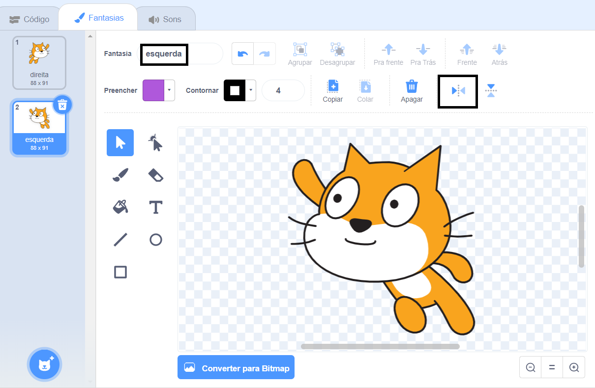

## Trocando de fantasia

Hmm, isso ficaria melhor se o gato mudasse de direção quando virar à esquerda.

--- task ---

Clique em 'Fantasia' e exclua a fantasia 'gato voando'.



--- /task ---

--- task ---

Renomeie o traje restante de 'gato voando' para 'direita'.



--- /task ---

--- task ---

Clique com o botão direito no vestuário e selecione duplicar para criar uma cópia



--- /task ---

--- task ---

Clique em 'Giro Horizontal' para reverter a cópia e nomeie-a como 'esquerda'.

Suas fantasias devem ficar assim:



--- /task ---

--- task ---

Clique em 'Código' para retornar ao seu código e adicionar blocos para mudar a fantasia quando a direção for alterada.


```blocks3
when [left arrow v] key pressed
+switch costume to (esquerda v)
turn ccw (15) degrees

when [right arrow v] key pressed
+switch costume to (direita v)
turn cw (15) degrees
```

--- /task ---

--- task ---

Teste seu código nadando pelo palco usando as teclas de seta do teclado


--- /task ---
