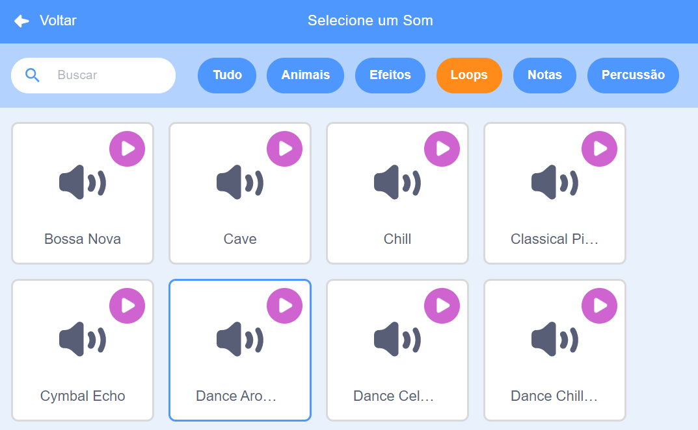

## Música!

Uma rotina de natação sincronizada precisa de música. (Mas, se você não consegue reproduzir som, pode pular esta etapa.)

--- task ---

Escolha um som entre a categoria de `Laços` e adicione-a no seu gato nadador

[[[generic-scratch3-sound-from-library]]]



--- /task ---

--- task ---

Agora volte para 'Código' e adicione os blocos para tocar sua música:


```blocks3
when green flag clicked
forever
play sound (dance around v) until done
end
```

Colocando `tocar música` {: class = "block3sound"} em um modo de repetição `contínuo` O {: class = "block3control"} significa que a música continuará se repetindo.

--- /task ---

--- task ---

Teste seu projeto.

Você pode clicar no botão vermelho para parar a reprodução da música!

--- /task ---

