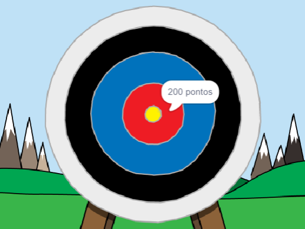

## E agora?

Dê uma olhada no projeto Scratch [Tiro com Arco](https://projects.raspberrypi.org/pt-BR/projects/archery).

--- no-print ---

Clique na bandeira verde para começar. Use a barra de espaço para atirar uma flecha

  <iframe allowtransparency="true" width="485" height="402" src="https://scratch.mit.edu/projects/embed/382680213/?autostart=false" frameborder="0" scrolling="no"></iframe>
  

--- /no-print ---

--- print-only ---

--- /print-only ---

***
Tradução Contribuída pela Comunidade

Este projeto foi traduzido por Paula Orizio Rodrigues e revisado por Flavio Silva.

Nossos incríveis voluntários de tradução nos ajudam a dar as crianças em todo o mundo a oportunidade de aprender a programar. Você pode nos ajudar a alcançar mais crianças traduzindo nossos projetos - leia mais em [rpf.io/translate](https://rpf.io/translate).
