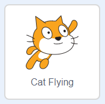

## Sağa ve sola yüzme

Senkronize yüzmede, yüzücülerden oluşan bir ekip, müzikle koordineli bir rutin gerçekleştirir.

Haydi bir kediyi yüzdürerek başlayalım.

--- task ---

Yeni bir Scratch projesi açın.

**Çevrimiçi:** [Yeni bir çevrimiçi Scratch projesi açın](http://rpf.io/scratchnew){:target="_blank"}.

**Çevrimdışı:** çevrimdışı editörde yeni bir proje açın.

Scratch çevrimdışı düzenleyicisini indirip yüklemeniz gerekirse, bunu [rpf.io/scratchoff adresinde bulabilirsiniz](http://rpf.io/scratchoff){:target="_blank"}.

--- /task ---

İlk önce sahneyi maviye çevirelim, böylelikle bir yüzme havuzuna benzecektir.

--- task ---

İlk olarak 'Sahne'ye, ardından 'Dekorlar' penceresine ve son olarak da Bitmap'e Dönüştür'e tıklayın.


--- /task ---

--- task ---

Mavi bir renk ve ardından 'Renkle doldur' aracını seçin. Daha sonra dekora tıklayın.


--- /task ---

--- task ---

Farklı bir kedi kuklası kullanacaksınız, üzerindeki çarpıya tıklayarak yürüyen kediyi silin.


--- /task ---

--- task ---

Kütüphaneden `Cat Flying (Uçan Kedi)` kuklasını seçin ve projenize ekleyin.

[[[generic-scratch3-sprite-from-library]]]



Uçan kedi yüzebilirmiş gibi duruyor.

--- /task ---

--- task ---

Şimdi kediyi yüzdürelim.

'Uçan Kedi' kuklasını seçin, 'Kod'a tıklayın ve sol ve sağ ok tuşlarına bastığınızda kedinin sola ve sağa dönmesini sağlamak için şu kodu ekleyin:


```blocks3
when [left arrow v] key pressed
turn ccw (15) degrees

when [right arrow v] key pressed
turn cw (15) degrees
```

--- /task ---

--- task ---

Klavyedeki sol ve sağ ok tuşlarına basarak kodunuzu test edin.


--- /task ---

--- task ---

İleri ve geri hareket kodlarını ekleyin.


```blocks3
when [up arrow v] key pressed
move (10) steps

when [down arrow v] key pressed
move (-10) steps 
```

--- /task ---

--- task ---

Ok tuşlarını kullanıp sahne etrafında yüzerek kodunuzu test edin.

--- /task ---
