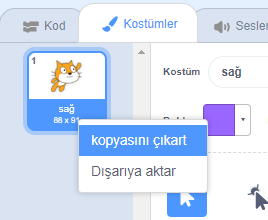
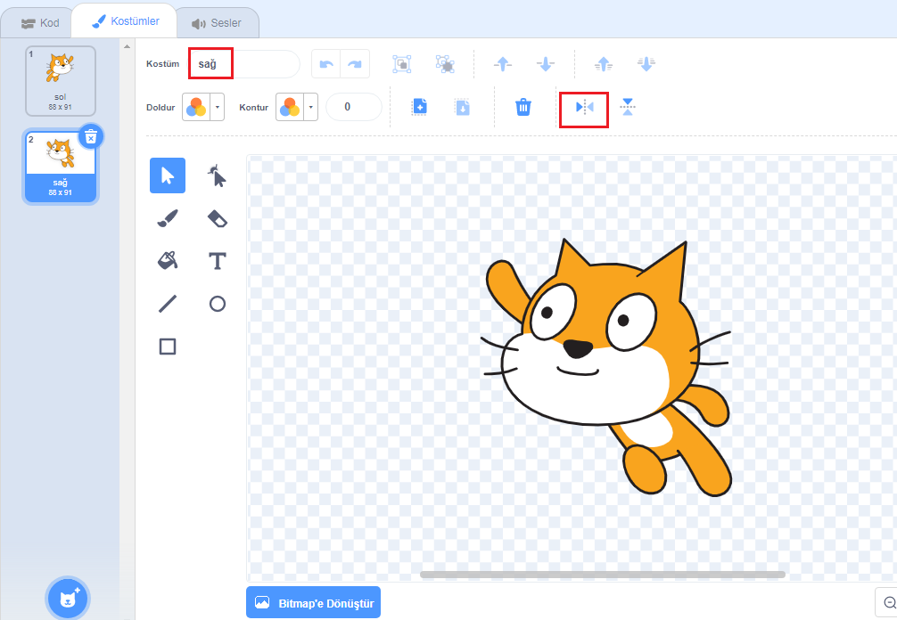

## Kostüm değiştirme

Hmm, kedi kuklası sola döndüğünde yön değiştirirse daha iyi görünecek sanki.

--- task ---

'Kostümler'e tıklayın ve 'uçan kedi-a' kostümünü silin.


--- /task ---

--- task ---

Kalan kostümün adı 'uçan kedi-b'yi 'sağ' olarak yeniden adlandırın.


--- /task ---

--- task ---

Kostüm üzerinde sağ tıklayın ve kostümün bir kopyasını oluşturmak için çoğalt seçeneğini tıklayın.



--- /task ---

--- task ---

Kopyayı tersine çevirmek için 'Yatay Çevir'e tıklayın ve ardından ismini 'sol' olarak yapın.

Kostümünüz şöyle görünmeli:



--- /task ---

--- task ---

Kodunuza dönmek için 'Kod'a tıklayın ve yön değiştiğinde kostümü değiştirmek için bloklar ekleyin.


```blocks3
when [left arrow v] key pressed
+switch costume to (left v)
turn ccw (15) degrees

when [right arrow v] key pressed
+switch costume to (right v)
turn cw (15) degrees
```

--- /task ---

--- task ---

Ok tuşlarını kullanıp sahne etrafında yüzerek kodunuzu test edin.


--- /task ---
