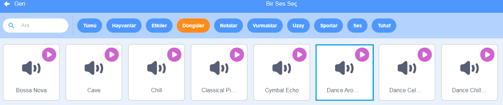

## Müzik!

Bir senkronize yüzme rutininin müziği olmalıdır. (Ancak sesi oynatamıyorsanız bu adımı atlayabilirsiniz.)

--- task ---

`Döngüler` kategorisinden bir ses seçin ve kuklanıza ekleyin.

[[[generic-scratch3-sound-from-library]]]



--- /task ---

--- task ---

Şimdi 'Kod'a geri dönün ve müziğinizi çalmak için blokları ekleyin:


```blocks3
when green flag clicked
forever
play sound (dance around v) until done
end
```

`Sesini başlat`{:class="block3sound"} bloğunu bir `sonsuz`{:class="block3control"} döngüye eklemek, müzik tekrar etmeye devam edecek demektir.

--- /task ---

--- task ---

Projenizi test edin.

Müziği durdurmak için kırmızı durdur butonuna tıklayabilirsiniz!

--- /task ---

