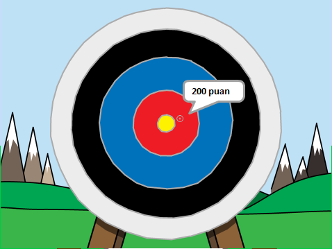

## Sırada ne var?

[Okçuluk](https://projects.raspberrypi.org/en/projects/archery) Scratch projesine bir göz atın.

--- no-print ---

Başlamak için yeşil bayrağa tıklayın. Bir ok atmak için boşluk tuşunu kullanın

  <iframe allowtransparency="true" width="485" height="402" src="https://scratch.mit.edu/projects/embed/114760038/?autostart=false" frameborder="0" scrolling="no"></iframe>
  

--- /no-print ---

--- print-only ---

--- /print-only ---
