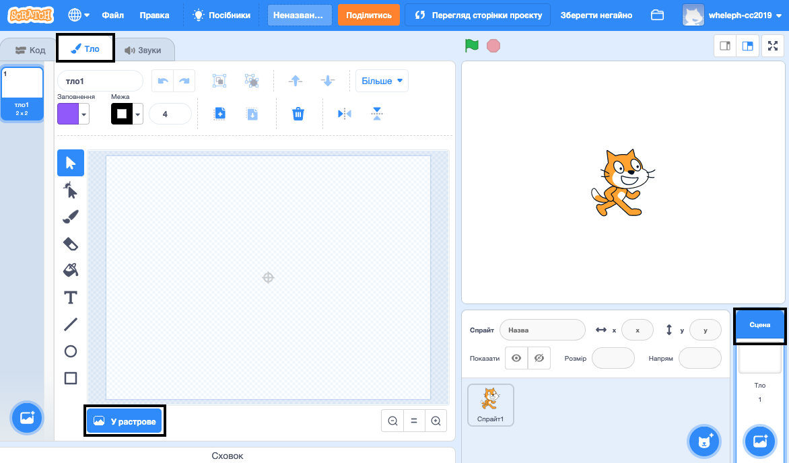

## Плавання ліворуч та праворуч

В синхронному плаванні команда плавців одночасно виконує фігури під музику.

Давай почнемо з того, щоб навчити одного кота плавати.

--- task ---

Відкрий новий проєкт Скретч.

**Онлайн**: відкрий [новий онлайн проєкт Скретч](https://rpf.io/scratchnew){:target="_blank"}.

**Офлайн**: відкрий новий проєкт в офлайн-редакторі.

Якщо тобі треба завантажити та встановити офлайн-редактор Скретч, то ти можеш його знайти на [rpf.io/scratchoff](https://rpf.io/scratchoff){:target="_blank"}.

--- /task ---

Спочатку давай зробимо сцену блакитною, щоб вона виглядала як басейн.

--- task ---

Клацни на «Сцена», а далі — вкладку «Тло» і натисни «У растрове».



--- /task ---

--- task ---

Вибери блакитний колір та інструмент «Заповнення», а далі клацни на тло.


--- /task ---

--- task ---

Ти будеш використовувати інший спрайт кота, тому клацни на хрест на коті, що ходить, щоб його видалити.


--- /task ---

--- task ---

Вибери спрайт `Cat Flying` із бібліотеки і додай його до свого проєкту.

[[[generic-scratch3-sprite-from-library]]]


Схоже, що цей летючий кіт може й плавати.

--- /task ---

--- task ---

Давай-но зробимо, щоб кіт плавав.

Вибери спрайт "Cat Flying", клацни "Код" і додай програму, щоб кіт повертався ліворуч та праворуч, коли ти натискаєш клавіші із відповідними стрілками.


```blocks3
when [left arrow v] key pressed
turn ccw (15) degrees

when [right arrow v] key pressed
turn cw (15) degrees
```

--- /task ---

--- task ---

Протестуй свій код, натискаючи на клавіші зі стрілками вліво та вправо.


--- /task ---

--- task ---

Також додай наступний код для руху вперед та назад.


```blocks3
when [up arrow v] key pressed
move (10) steps

when [down arrow v] key pressed
move (-10) steps 
```

--- /task ---

--- task ---

Протестуй свій код, плаваючи по сцені за допомогою клавіш.

--- /task ---
