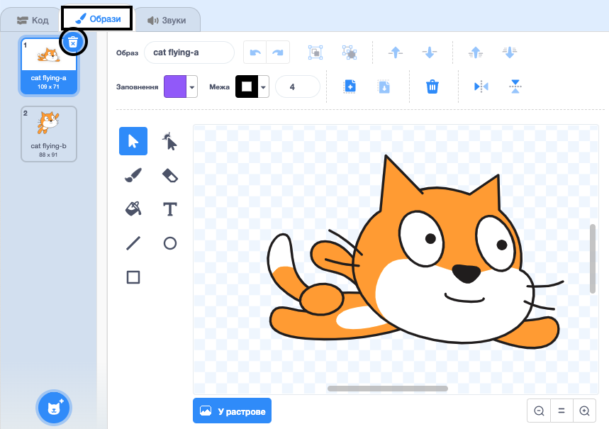
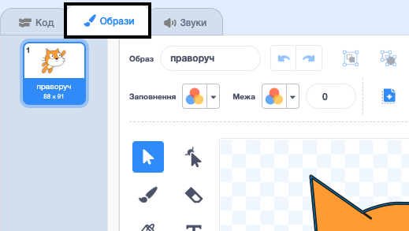
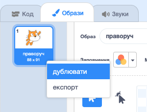
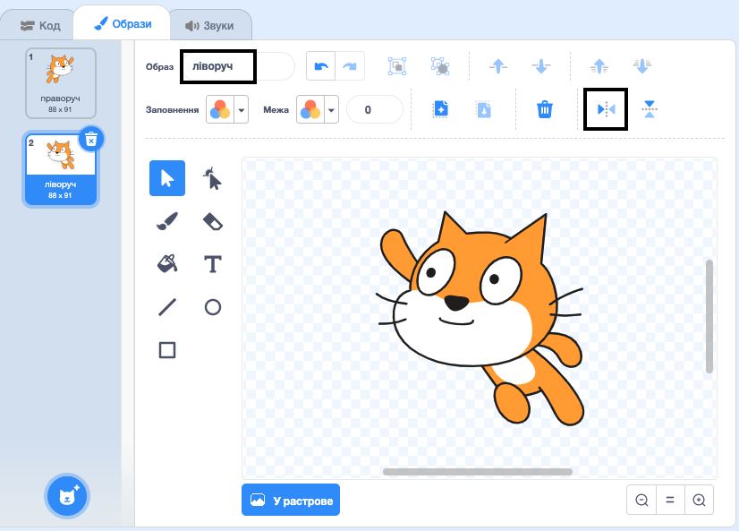

## Зміна образу

Гм, було б краще, якби спрайт кота змінював напрямок, коли він повертається ліворуч.

--- task ---

Клацни на «Образи» і видали образ «cat flying-a».



--- /task ---

--- task ---

Перейменуй образ, що залишився із «cat flying-b» в «праворуч».



--- /task ---

--- task ---

Клацни правою кнопкою мишки по цьому образу і вибери «дублювати», щоб створити його копію.



--- /task ---

--- task ---

Клацни «Право-ліво», щоб віддзеркалити цю копію і назви її «ліворуч».

Твої образи мають виглядати так:



--- /task ---

--- task ---

Клацни «Код» для повернення до своєї програми і додай блоки для зміни образу разом зі зміною напряму.


```blocks3
when [left arrow v] key pressed
+switch costume to (left v)
turn ccw (15) degrees

when [right arrow v] key pressed
+switch costume to (right v)
turn cw (15) degrees
```

--- /task ---

--- task ---

Протестуй свій код, плаваючи по сцені за допомогою клавіш.


--- /task ---
