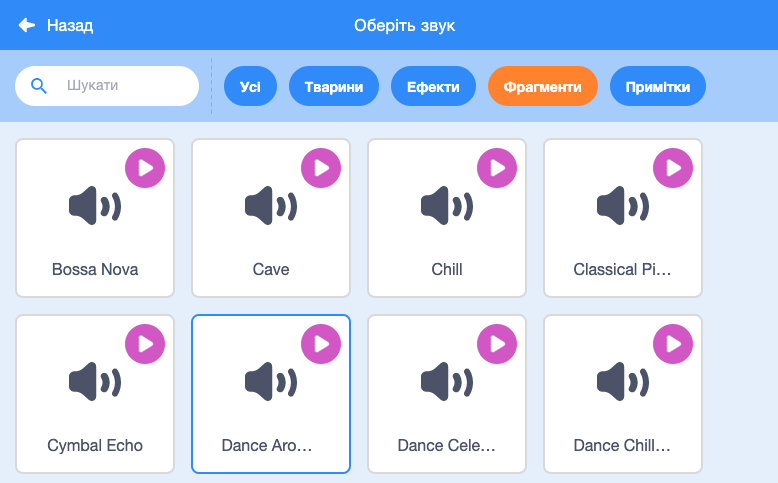

## Музика!

Для фігур синхронного плавання потрібна музика. (Але якщо ти не маєш можливості відтворювати звук, можеш пропустити цей крок.)

--- task ---

Вибери звук із розділу `Фрагменти` і додай його до свого спрайту.

[[[generic-scratch3-sound-from-library]]]



--- /task ---

--- task ---

Тепер повернися в «Код» і додай блоки для відтворення музики:


```blocks3
when green flag clicked
forever
play sound (dance around v) until done
end
```

Те, що блок `відтворити звук`{:class="block3sound"} знаходиться всередині циклу `завжди`{:class="block3control"}, означає, що музика буде повторюватися.

--- /task ---

--- task ---

Протестуй свій проєкт.

Ти можеш клацнути на червону кнопку «Стоп», щоб зупинити музику!

--- /task ---

