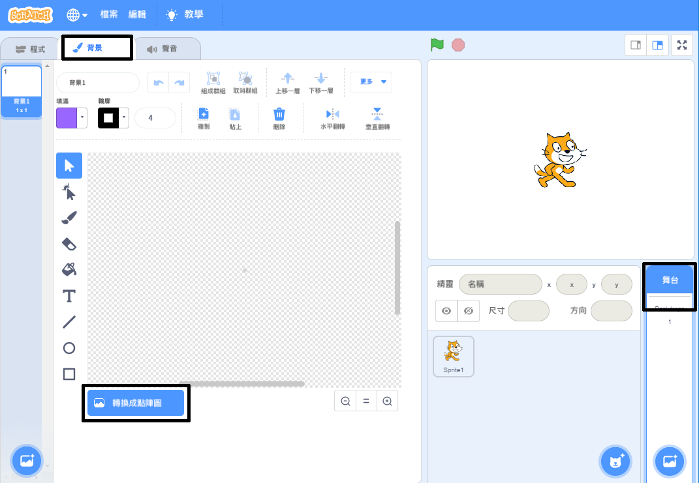
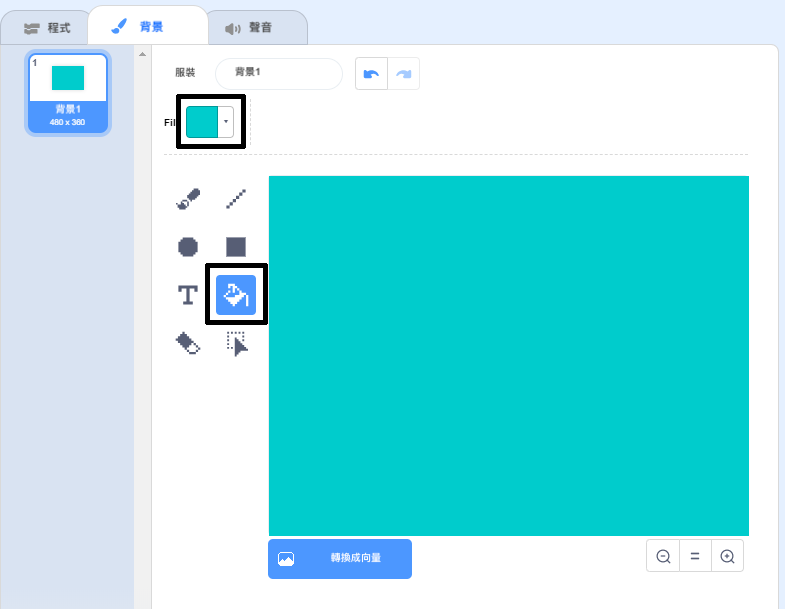
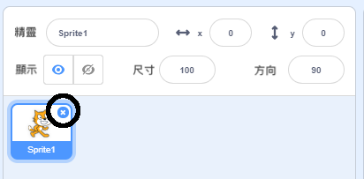
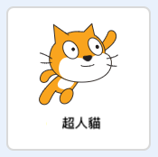
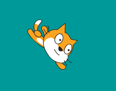

## 向左游、向右游

在水上芭蕾中，一組舞者們執行一套與音樂融合並編排過的舞組。

我們先讓一隻貓學會游泳當作開頭。

--- task ---

建立一個新的 Scratch 專案。

**線上版**: 開啟一個[新的線上Scratch專案](http://rpf.io/scratchnew){:target="_blank"}.

**離線版**: 在離線編輯器開啟新專案。

如果你需要下載 Scratch 離線版編輯器，可以連結到 [rpf.io/scratchoff](http://rpf.io/scratchoff){:target="_blank"}。

--- /task ---

首先，讓我們將舞台顏色換成藍色，這樣看起來會像是個游泳池。

--- task ---

點擊“舞台”、點擊“背景”標籤和“轉換成點陣圖”。



--- /task ---

--- task ---

選擇一種藍色和“ 填滿顏色”工具列，然後點擊背景。



--- /task ---

--- task ---

You're going to use a different cat sprite so click on the cross on the walking cat to delete it.



--- /task ---

--- task ---

從圖庫中選擇` Cat Flying `精靈並加入到您的專案中。

[[[generic-scratch3-sprite-from-library]]]



超人貓的姿勢看起來像在游泳。

--- /task ---

--- task ---

現在讓我們開始教貓游泳。

選擇“超人貓”精靈，點擊“程式”並撰寫“程式碼”讓我們能用向左/右方向鍵控制貓向左/右旋轉。


```blocks3
when [left arrow v] key pressed
turn ccw (15) degrees

when [right arrow v] key pressed
turn cw (15) degrees
```

--- /task ---

--- task ---

在鍵盤上按左/右箭頭鍵來測試你寫的程式。



--- /task ---

--- task ---

撰寫程式碼來控制精靈貓的前後移動。


```blocks3
when [up arrow v] key pressed
move (10) steps

when [down arrow v] key pressed
move (-10) steps 
```

--- /task ---

--- task ---

用方向鍵來測試你的寫好的程式，看看你能不能讓精靈貓在舞台上游泳。

--- /task ---
