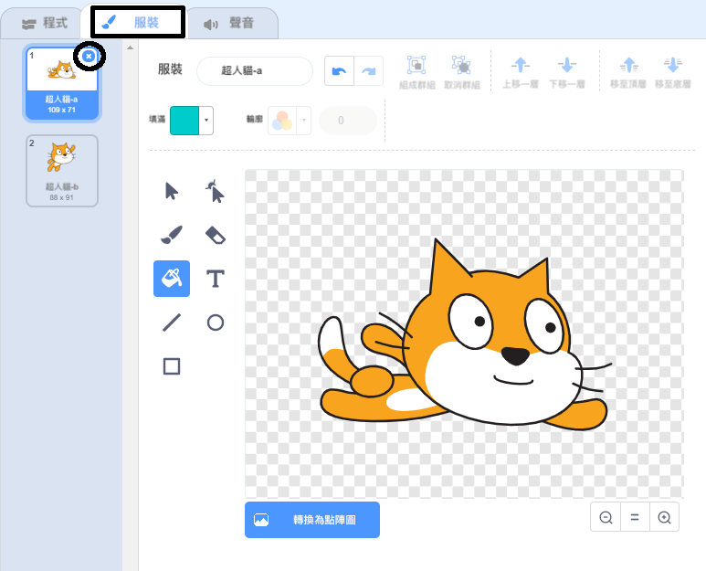
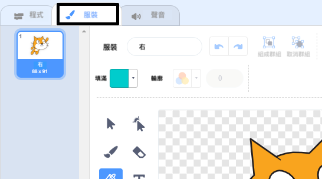
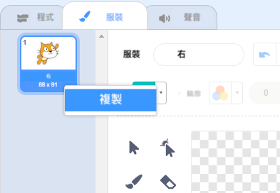

## 改變造型

恩⋯⋯看起來精靈貓改為向左的方向會更好。

--- task ---

點擊“服裝”並刪除“超人貓-a”的服裝。



--- /task ---

--- task ---

讓我們來重新命名剩下的造型，從”超人貓-b”重新命名為“右”。



--- /task ---

--- task ---

在服裝上按右鍵，然後點擊複製來創造一個複製物件。



--- /task ---

--- task ---

單擊“水平翻轉”以反轉複製物件，然後取名為“左”。

你的服裝應該會像這樣：


--- /task ---

--- task ---

點擊“程式”返回，添加一個當貓的方向改變時能更換服裝功能的方塊。


```blocks3
when [left arrow v] key pressed
+switch costume to (left v)
turn ccw (15) degrees

when [right arrow v] key pressed
+switch costume to (right v)
turn cw (15) degrees
```

--- /task ---

--- task ---

用方向鍵來測試你的寫好的程式，看看你能不能讓精靈貓在舞台上游泳。


--- /task ---
