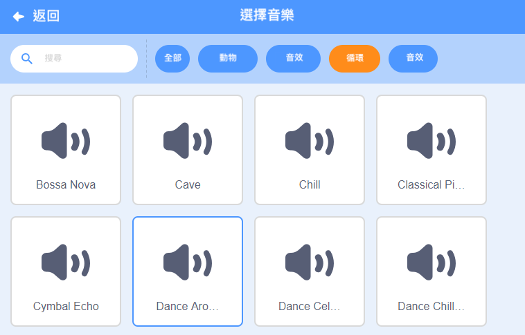

## 音樂！

一套水上芭蕾舞蹈需要音樂。 （但是，如果你無法播放聲音，可以跳過此步驟。）

--- task ---

在`循環`分類中選擇一種音樂加入至你的精靈貓。

[[[generic-scratch3-sound-from-library]]]



--- /task ---

--- task ---

現在回到“程式”並添加方塊來播放音樂：


```blocks3
when green flag clicked
forever
play sound (dance around v) until done
end
```

在`forever`{:class="block3control"}迴圈內放置`play sound`{:class="block3sound"}，意味著讓音樂將不斷播放。

--- /task ---

--- task ---

測試您的專案。

你可以點擊紅色的停止按鈕來停止播放音樂！

--- /task ---

