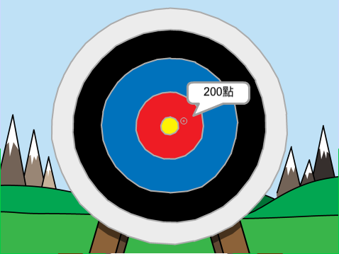

## 接下來是什麼？

看看[射箭](https://projects.raspberrypi.org/en/projects/archery)Scratch專案。

--- no-print ---

點擊綠旗開始。 使用空格鍵，即可射箭

  <iframe allowtransparency="true" width="485" height="402" src="https://scratch.mit.edu/projects/embed/114760038/?autostart=false" frameborder="0" scrolling="no"></iframe>
  

--- /no-print ---

--- print-only ---

--- /print-only ---
